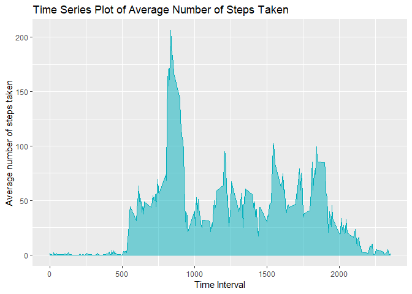

## Loading and preprocessing the data

### Q1 - Code for reading in the dataset and/or processing the data

 - Show any code that is needed to
 - Load the data (i.e. \color{red}{\verb|read.csv()|}read.csv())
 - Process/transform the data (if necessary) into a format suitable for your analysis


Set the current working directory


```r
setwd("C:\\Users\\Ishwa\\Desktop\\DataScience\\R\\Reproducible Research\\Week 2\\RepData_PeerAssessment1\\")
path <- getwd()
path
```

```
## [1] "C:/Users/Ishwa/Desktop/DataScience/R/Reproducible Research/Week 2/RepData_PeerAssessment1"
```
1. Load the data (i.e. \color{red}{\verb|read.csv()|}read.csv())
2. Process/transform the data (if necessary) into a format suitable for your analysis


```r
activity <- read.csv(unz("activity.zip", "activity.csv"),header=TRUE, sep=",", colClasses=c(NA, "Date",NA))
```

## What is mean total number of steps taken per day?
### Q2 - Histogram of the total number of steps taken each day

1. Calculate the total number of steps taken per day


```r
library(dplyr)
```

```
## Warning: package 'dplyr' was built under R version 3.5.3
```

```
## 
## Attaching package: 'dplyr'
```

```
## The following objects are masked from 'package:stats':
## 
##     filter, lag
```

```
## The following objects are masked from 'package:base':
## 
##     intersect, setdiff, setequal, union
```

```r
total_actv <- activity %>% group_by(date) %>% summarise(total_steps= sum(steps, na.rm=TRUE))

head(total_actv)
```

```
## # A tibble: 6 x 2
##   date       total_steps
##   <date>           <int>
## 1 2012-10-01           0
## 2 2012-10-02         126
## 3 2012-10-03       11352
## 4 2012-10-04       12116
## 5 2012-10-05       13294
## 6 2012-10-06       15420
```
 
2. Make a histogram of the total number of steps taken each day


```r
hist(total_actv$total_steps, main= "Histogram of Total Number of Steps Taken each Day", col="orange", 
     xlab= "Number of steps taken in a day")
```

<!-- -->
 
### Q3 - Mean and median number of steps taken each day
 
3. Calculate and report the mean and median of the number of steps taken per day
 

```r
library(ggplot2)
```

```
## Warning: package 'ggplot2' was built under R version 3.5.3
```

```r
## Summarize the activity by calculating the mean and median of steps taken each day

actv_summary_date <- activity %>% group_by(date) %>% summarise(steps_mean= mean(steps, na.rm=TRUE), steps_median= median(steps, na.rm=TRUE), steps_min = min(steps, na.rm=TRUE), steps_count_unique= n_distinct(steps,na.rm=TRUE))

actv_summary_date
```

```
## # A tibble: 61 x 5
##    date       steps_mean steps_median steps_min steps_count_unique
##    <date>          <dbl>        <dbl>     <dbl>              <int>
##  1 2012-10-01    NaN               NA       Inf                  0
##  2 2012-10-02      0.438            0         0                  3
##  3 2012-10-03     39.4              0         0                 65
##  4 2012-10-04     42.1              0         0                 76
##  5 2012-10-05     46.2              0         0                 73
##  6 2012-10-06     53.5              0         0                 86
##  7 2012-10-07     38.2              0         0                 82
##  8 2012-10-08    NaN               NA       Inf                  0
##  9 2012-10-09     44.5              0         0                 73
## 10 2012-10-10     34.4              0         0                 80
## # ... with 51 more rows
```

```r
summary(actv_summary_date)
```

```
##       date              steps_mean       steps_median   steps_min  
##  Min.   :2012-10-01   Min.   : 0.1424   Min.   :0     Min.   :  0  
##  1st Qu.:2012-10-16   1st Qu.:30.6979   1st Qu.:0     1st Qu.:  0  
##  Median :2012-10-31   Median :37.3785   Median :0     Median :  0  
##  Mean   :2012-10-31   Mean   :37.3826   Mean   :0     Mean   :Inf  
##  3rd Qu.:2012-11-15   3rd Qu.:46.1597   3rd Qu.:0     3rd Qu.:  0  
##  Max.   :2012-11-30   Max.   :73.5903   Max.   :0     Max.   :Inf  
##                       NA's   :8         NA's   :8                  
##  steps_count_unique
##  Min.   : 0.00     
##  1st Qu.:50.00     
##  Median :66.00     
##  Mean   :56.38     
##  3rd Qu.:73.00     
##  Max.   :93.00     
## 
```

```r
## Plot the mean and median values for each date

cols <- c("MEDIAN"="#3591d1","MEAN"="#62c76b")
ggplot(actv_summary_date, aes(x=date)) + 
  geom_bar(aes(y=steps_mean, fill="MEAN"), stat="identity", alpha=0.75,position="dodge")+
  geom_line(data=actv_summary_date, aes(x=date, y=steps_median, colour="MEDIAN")) +
  labs(x = "Date",y = "Number of steps taken", fill="", title= "Summary of Mean and Median Steps Taken") + 
  theme(axis.text.x = element_text(angle = 45),legend.position="bottom")+
  scale_colour_manual(values=cols, name= "Plot Type")
```

```
## Warning: Removed 8 rows containing missing values (geom_bar).
```

```
## Warning: Removed 2 rows containing missing values (geom_path).
```

<!-- -->

## What is the average daily activity pattern?

### Q4 - Time series plot of the average number of steps taken

1. Make a time series plot (i.e. \color{red}{\verb|type = "l"|}type="l") of the 5-minute interval (x-axis) and the average number of steps taken, averaged across all days (y-axis)


```r
ggplot(actv_summary_date, aes(date, steps_mean)) + 
  geom_area(alpha = 0.5, color="#00AFBB", fill="#00AFBB") +
  labs(x = "Date",y = "Average number of steps taken",
       title= "Time Series Plot of Average Number of Steps Taken") 
```

```
## Warning: Removed 8 rows containing missing values (position_stack).
```

<!-- -->

### Q5 - The 5-minute interval that, on average, contains the maximum number of steps

2. Which 5-minute interval, on average across all the days in the dataset, contains the maximum number of steps?


```r
actv_summary_inter <- activity %>% group_by(interval) %>% summarise(steps_mean= mean(steps, na.rm=TRUE))

max_step_interval <- actv_summary_inter[which.max(actv_summary_inter$steps_mean),]$interval
```

Invertal **#835** has the maximum number of steps taken on average.

## Imputing missing values


```r
na_count <- sum(is.na(activity$steps))
na_pct <-  (na_count/dim(activity)[1]) * 100
```

### Q6 - Code to describe and show a strategy for imputing missing data


#### Imputing strategy selected:

1) Calculate and report the total number of missing values in the dataset (i.e. the total number of rows with  NAs

The dataset has **2304** number of missing values which account for **13.1147541%** of the data.


```r
print("Summary before imputing NA values")
```

```
## [1] "Summary before imputing NA values"
```

```r
summary(activity)
```

```
##      steps             date               interval     
##  Min.   :  0.00   Min.   :2012-10-01   Min.   :   0.0  
##  1st Qu.:  0.00   1st Qu.:2012-10-16   1st Qu.: 588.8  
##  Median :  0.00   Median :2012-10-31   Median :1177.5  
##  Mean   : 37.38   Mean   :2012-10-31   Mean   :1177.5  
##  3rd Qu.: 12.00   3rd Qu.:2012-11-15   3rd Qu.:1766.2  
##  Max.   :806.00   Max.   :2012-11-30   Max.   :2355.0  
##  NA's   :2304
```

2) Devise a strategy for filling in all of the missing values in the dataset. The strategy does not need to be sophisticated. For example, you could use the mean/median for that day, or the mean for that 5-minute interval, etc.

  As per the plot from Q3 for the summary of mean and median values, the median number of steps taken for all the days is zero. It makes more sense to impute the missing values with the median.

3) Create a new dataset that is equal to the original dataset but with the missing data filled in.

```r
activity_imp_na <- data.frame(activity)

activity_imp_na$steps[is.na(activity_imp_na$steps)] <- median(activity_imp_na$step, na.rm = TRUE)

print("Summary after imputing NA values")
```

```
## [1] "Summary after imputing NA values"
```

```r
summary(activity_imp_na)
```

```
##      steps             date               interval     
##  Min.   :  0.00   Min.   :2012-10-01   Min.   :   0.0  
##  1st Qu.:  0.00   1st Qu.:2012-10-16   1st Qu.: 588.8  
##  Median :  0.00   Median :2012-10-31   Median :1177.5  
##  Mean   : 32.48   Mean   :2012-10-31   Mean   :1177.5  
##  3rd Qu.:  0.00   3rd Qu.:2012-11-15   3rd Qu.:1766.2  
##  Max.   :806.00   Max.   :2012-11-30   Max.   :2355.0
```

### Q7 - Histogram of the total number of steps taken each day after missing values are imputed

4) Make a histogram of the total number of steps taken each day and Calculate and report the mean and median total number of steps taken per day. Do these values differ from the estimates from the first part of the assignment? What is the impact of imputing missing data on the estimates of the total daily number of steps?

  As the NA values are imputed with zeros there is no difference in the total daily number of steps taken


```r
total_actv <- activity_imp_na %>% group_by(date) %>% summarise(total_steps= sum(steps, na.rm=TRUE))

hist(total_actv$total_steps, main= "Total Number of Steps Taken each Day after Imputing Missing Values", col="#A0A000", xlab= "Number of steps taken in a day after imputing missing values")
```

<!-- -->


## Are there differences in activity patterns between weekdays and weekends?

### Q8 - Panel plot comparing the average number of steps taken per 5-minute interval across weekdays and weekends

1. Create a new factor variable in the dataset with two levels - "weekday" and "weekend" indicating whether a given date is a weekday or weekend day.


```r
library(lubridate)
```

```
## Warning: package 'lubridate' was built under R version 3.5.3
```

```
## 
## Attaching package: 'lubridate'
```

```
## The following object is masked from 'package:base':
## 
##     date
```

```r
head(activity_imp_na)
```

```
##   steps       date interval
## 1     0 2012-10-01        0
## 2     0 2012-10-01        5
## 3     0 2012-10-01       10
## 4     0 2012-10-01       15
## 5     0 2012-10-01       20
## 6     0 2012-10-01       25
```

```r
## Check for the weekend
check_weekend <- function(day) {if(day%in% c(1,7)) "Weekend" else "Weekday"}  
activity_imp_na$day<- as.factor(sapply(wday(activity_imp_na$date),check_weekend))
str(activity_imp_na)
```

```
## 'data.frame':	17568 obs. of  4 variables:
##  $ steps   : num  0 0 0 0 0 0 0 0 0 0 ...
##  $ date    : Date, format: "2012-10-01" "2012-10-01" ...
##  $ interval: int  0 5 10 15 20 25 30 35 40 45 ...
##  $ day     : Factor w/ 2 levels "Weekday","Weekend": 1 1 1 1 1 1 1 1 1 1 ...
```

2) Make a panel plot containing a time series plot (i.e. \color{red}{\verb|type = "l"|}type="l") of the 5-minute interval (x-axis) and the average number of steps taken, averaged across all weekday days or weekend days (y-axis). See the README file in the GitHub repository to see an example of what this plot should look like using simulated data.


```r
## Calculate the average steps taken for each interval for weekdays and weekends
actv_summ_inter_day <- activity_imp_na %>% group_by(interval,day) %>% summarise(mean_steps= mean(steps))

## Plot the activity Patter for weekday and weekends
ggplot(data=actv_summ_inter_day,aes(x=interval,y=mean_steps, col=day)) + facet_grid(day~.) + geom_line(lwd=.9)+ labs(color="Day of the Week", x="Interval", y= " Average Steps Taken", 
title = "Activity Patterns Between Weekdays and Weekends") + theme_bw() + 
theme(plot.title = element_text(hjust=0.5))
```

<!-- -->

### Q9 - All of the R code needed to reproduce the results (numbers, plots, etc.) in the report

The PA1_template.Rmd file has all the R code needed to reproduce the results
